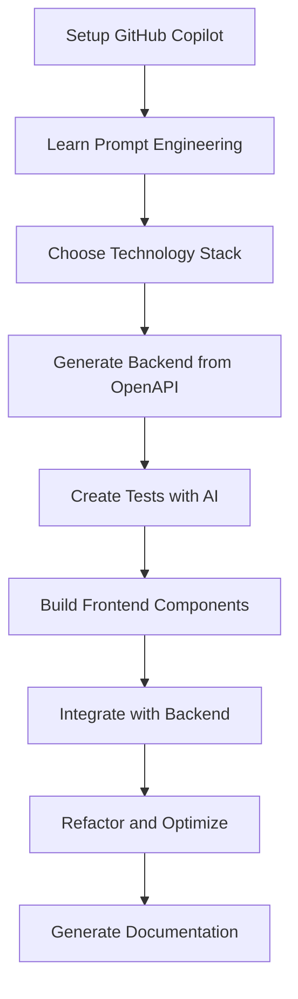
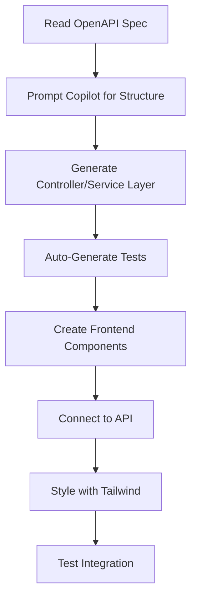

# Product Context

## Why This Project Exists

### The Problem We Solve

**Gap in AI-Assisted Development Education**
- Developers struggle to effectively utilize GitHub Copilot beyond basic autocompletion
- Lack of structured learning paths for AI-powered development workflows
- Missing examples of how to leverage AI across different technology stacks
- Need for hands-on practice with real-world, production-ready applications

**Workshop Learning Challenges**
- Traditional coding workshops focus on syntax rather than modern AI-assisted workflows
- Developers need to see AI assistance in action across multiple technology paradigms
- Missing integration between AI tools and established architectural patterns

### The Solution

**Comprehensive AI-Assisted Development Workshop**
This project provides a structured learning environment where developers master GitHub Copilot through building identical ToDo applications across four different technology stacks, demonstrating how AI assistance adapts to different programming paradigms.

## How It Should Work

### User Experience Goals

**For Workshop Participants:**
1. **Progressive Learning** - Start with setup, advance through backend/frontend development
2. **Hands-On Practice** - Build real applications rather than toy examples
3. **Cross-Stack Exposure** - Experience AI assistance in Java, C#, TypeScript, and modern frameworks
4. **Best Practice Integration** - Learn how AI tools fit into established architectural patterns

**For Workshop Instructors:**
1. **Ready-to-Use Materials** - Complete codebase with documentation and instructions
2. **Flexible Delivery** - Modular structure allows focusing on specific stacks or phases
3. **Demonstration Platform** - Live examples of AI-generated code across all implementations

### Core User Flows

#### Workshop Participant Journey

#### Development Workflow

## Application Features

### Core ToDo Functionality
- **Task Management** - Create, read, update, delete tasks
- **Status Tracking** - TODO, IN_PROGRESS, DONE states
- **Due Date Management** - Date/time scheduling with visual indicators
- **Search & Filter** - Find tasks by name, description, or status
- **Sorting Options** - Order by due date, status, or name

### UI/UX Requirements

#### Core Interface Design
- **Single-Screen Application** - No navigation between views, all tasks visible on main screen
- **Dialog-Based Forms** - Overlay modals for create/edit operations (NOT separate screens)
- **Sidebar Navigation** - Filters, search, and sorting controls in left panel
- **Responsive Design** - Mobile, tablet, and desktop support with touch-friendly interface
- **Modern Visual Design** - Clean, professional interface with Tailwind CSS utility classes

#### Visual Mockup References
All UI implementations must follow the exact designs shown in:
- **[Main View](../../docs/frontend/mockups/1_main_view.png)** - Primary interface layout with task list and sidebar
- **[Add Task Dialog](../../docs/frontend/mockups/2.3_add_task_dialog_view.png)** - Modal dialog for task creation
- **[Edit Task Dialog](../../docs/frontend/mockups/3.2_edit_task_dialog_view.png)** - Modal dialog for task editing
- **[Delete Confirmation](../../docs/frontend/mockups/4_delete_task_view.png)** - Delete confirmation workflow

#### Key Design Principles
- **Persistent Context** - Users never lose sight of their task list during operations
- **Immediate Actions** - Edit and Delete buttons visible on each task for instant access
- **No Page Navigation** - All task management happens on one screen without routing
- **Top-Right Creation** - "Add Task" button prominently placed in header
- **Visual Status Indicators** - Color-coded status badges and due date urgency indicators

### Technical Integration
- **API-First Design** - Frontend applications consume REST APIs
- **Real-Time Updates** - Consistent state across all operations
- **Error Handling** - Graceful failure management and user feedback
- **Performance** - Optimized for smooth user interactions

## Success Metrics

### Educational Effectiveness
- Participants can generate complete API endpoints using Copilot prompts
- Developers understand how to create comprehensive tests with AI assistance
- Workshop graduates apply learned patterns to their own projects

### Technical Quality
- All implementations pass integration tests
- Code quality meets production standards
- Applications handle edge cases gracefully
- Performance meets responsive user experience requirements

The product serves as both a functional task management application and a comprehensive learning platform for AI-assisted development across multiple technology stacks.